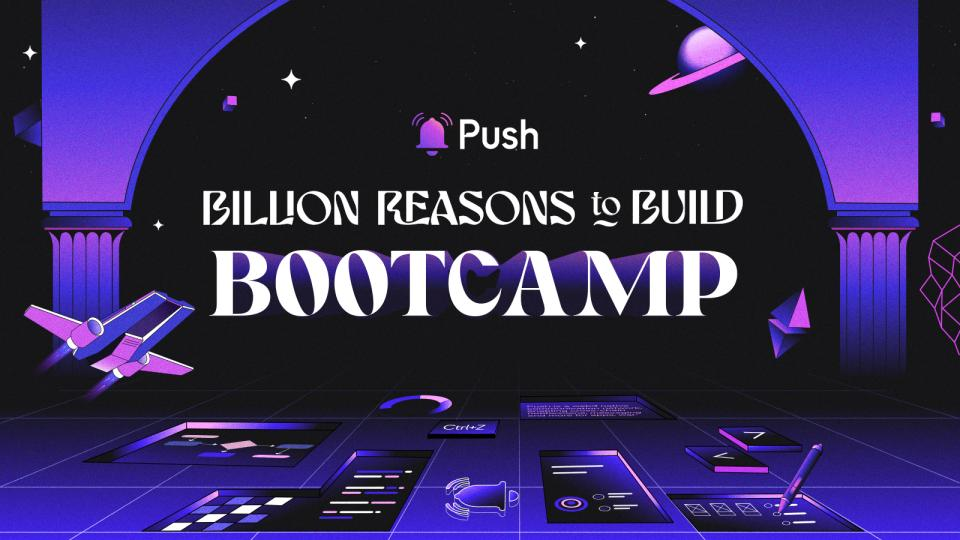
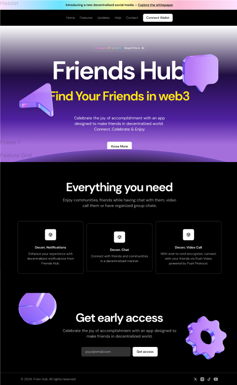

# BRB Bootcamp: Pushing the Boundary Challenge

The BRB Bootcamp is a 6-week virtual bootcamp by [Push Protocol](push.org/bootcamp). During the program, a challenge is organized to create a product using Push Features. The following idea & all the non technical things was proposed by me during this challenge.

## About the Project

# Team 15 : Team Incognito🔒

Ideator: [@jishantukripal](https://github.com/jishantukripal)

## Project Name: FrenHub 🚀

### Project Introduction 🌐: 
FrenHub is an innovative decentralized social media app that facilitates connections among individuals with similar interests. Utilizing push chat and advanced push stack tools, FrenHub offers a platform for users to share their ideas securely and interactively.

## Tech Stack 🛠️

- **Frontend:** React / Next.js + ThirdWeb SDK
- **Backend:** Node.js + Express
- **Protocol:** Push Protocol

## Marketing Plan 📢

🔗 Notion Page: [https://fossil-mousepad-b8c.notion.site/Fren-Hub-Marketing-Plan-7b60032b0463454e9e854b9ad102f1c0](https://fossil-mousepad-b8c.notion.site/Fren-Hub-Marketing-Plan-7b60032b0463454e9e854b9ad102f1c0)

## Design 📊

## Contact: 
💌 Email: contact.frenhub@gmail.com
---

> ⚠️ PS: I'm working on this idea of fren-hub. I am going to continue this project for the next few months & hope to complete its technical side as well. 

Please provide valuable feedback about anything we can explore/add, or keep in our future scope !!

---
